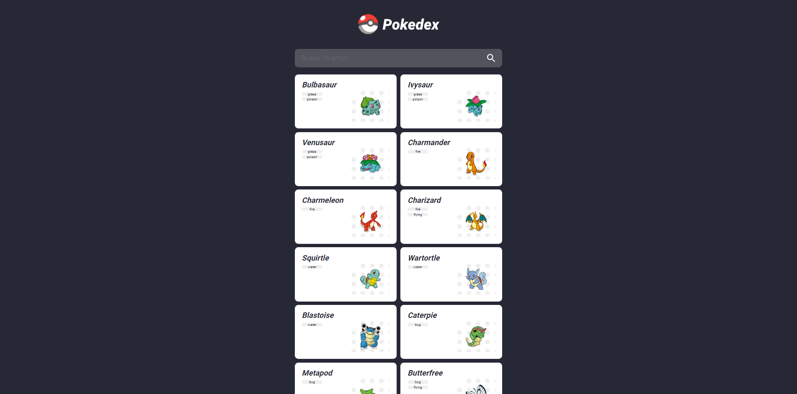
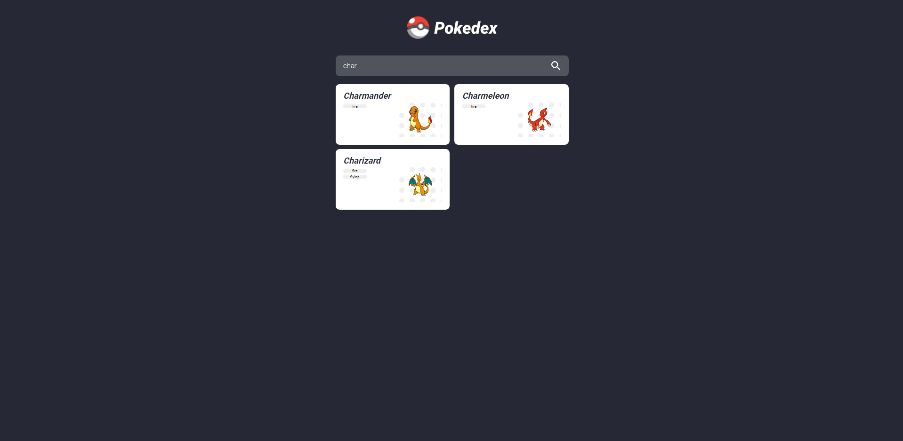
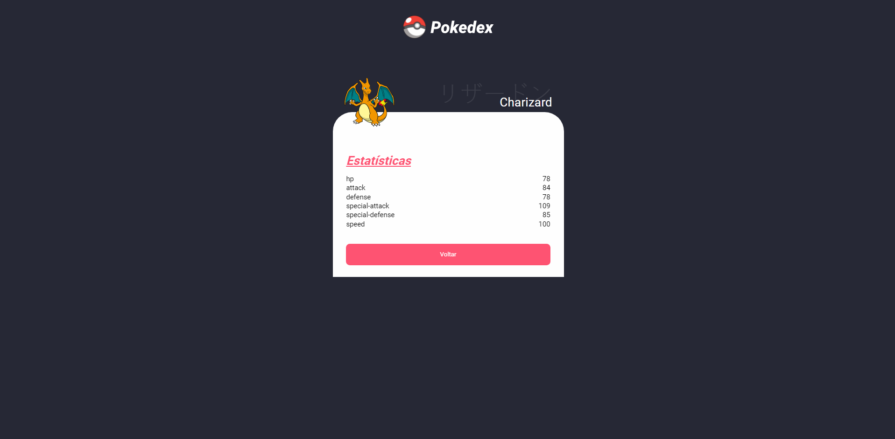

### Sobre

- Projeto simples feito com angular para aplicar os conhecimentos que venho adquirindo

### Como funciona

- Na aplicação o usuário tem acesso a uma pokedex com pokemons da primeira geração
- A lista de pokemons pode ser filtrada através de um campo de buscar por nome
- Ao clicar em um card de um pokemon, o usuário é levado até uma página mais detalhada sobre tal pokemon

### Como rodar

- Basta fazer um git clone na sua máquina e rodar o comando: `` ng s --o ``

### Aplicação em funcionamento

- Pokedex

  

- Filtro

  

- Detalhes

  
